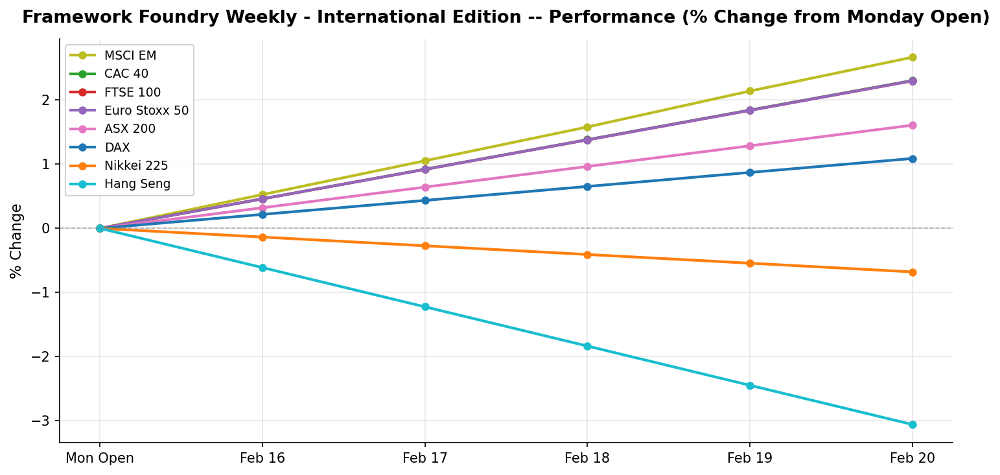

# Framework Foundry Weekly — International Edition

**Week ending 2026-02-21**

---

## The Week in Brief

International markets posted mostly gains this week, with MSCI EM (Emerging Markets) leading at +2.67% and Hang Seng (Asia-Pacific) lagging at -3.06%. European indices outperformed on average (+2.00%); Asia-Pacific lagged (-0.71% average); Emerging Markets (MSCI EM) moved +2.67%. On the FX front, the Euro weakened 0.82%, the Swiss Franc weakened 0.92%, the British Pound weakened 1.37%, and the Japanese Yen weakened 1.53%, all against the USD.

The macro picture was eventful. Japan Q4 GDP (Preliminary) came in below expectations (-0.4% vs. 0.3%). UK CPI (YoY) came in above expectations (3.1% vs. 2.8%). China Caixin Services PMI came in above expectations (52.3 vs. 51.8). The combination of sticky inflation and weak growth (a stagflationary signal) puts central banks in a difficult position and argues for a cautious stance on duration and rate-sensitive sectors.

Looking ahead, key events to watch are: BOJ Meeting Minutes, ECB Rate Decision, Eurozone CPI Flash (YoY). Central bank decisions in particular can drive sharp FX and equity moves; position sizing should reflect that risk.

---

## Market Snapshot

| Index | Region | Close | Weekly % | Week Range |
|-------|--------|------:|--------:|-----------:|
| MSCI EM | Emerging Markets | 62.34 | +2.67% | 60.13 - 62.36 |
| CAC 40 | Europe | 8,515.49 | +2.31% | 8,292.13 - 8,529.00 |
| FTSE 100 | Europe | 10,686.90 | +2.30% | 10,446.30 - 10,745.80 |
| Euro Stoxx 50 | Europe | 6,131.31 | +2.30% | 5,954.14 - 6,140.95 |
| ASX 200 | Asia-Pacific | 9,081.40 | +1.61% | 8,937.10 - 9,118.30 |
| DAX | Europe | 25,260.69 | +1.09% | 24,734.04 - 25,331.06 |
| Nikkei 225 | Asia-Pacific | 56,825.70 | -0.68% | 56,135.12 - 57,709.82 |
| Hang Seng | Asia-Pacific | 26,413.35 | -3.06% | 26,356.96 - 27,325.98 |

**Best performer:** MSCI EM (+2.67%)
| **Worst performer:** Hang Seng (-3.06%)

### FX Rates

| Pair | Rate | Weekly % |
|------|-----:|--------:|
| AUD/USD | 0.7056 | -0.20% |
| EUR/USD | 1.1769 | -0.82% |
| CHF/USD | 1.2898 | -0.92% |
| GBP/USD | 1.3461 | -1.37% |
| JPY/USD | 0.0065 | -1.53% |

---

## Last Week's Economic Events

### Japan Q4 GDP (Preliminary) (2026-02-17)

| | |
|---|---|
| **Actual** | -0.4% |
| **Expected** | 0.3% |
| **Previous** | 0.9% |
| **Surprise** | below |

**Investor Impact:** Japan's economy unexpectedly contracted in Q4, raising doubts about the BOJ's path toward policy normalization. Growth weakness undercuts the case for further rate hikes and may weigh on EWJ near-term.

### ECB Meeting Minutes (2026-02-18)

| | |
|---|---|
| **Actual** | -- |
| **Expected** | -- |
| **Previous** | -- |
| **Surprise** | neutral |

**Investor Impact:** Minutes showed broad consensus to hold rates steady at 2.75%, with most members citing improving but still elevated services inflation. The tone was modestly hawkish -- no imminent cuts, but the door is open for H2 2026 if disinflation continues.

### UK CPI (YoY) (2026-02-19)

| | |
|---|---|
| **Actual** | 3.1% |
| **Expected** | 2.8% |
| **Previous** | 2.9% |
| **Surprise** | above |

**Investor Impact:** UK inflation re-accelerated, complicating the Bank of England's rate-cut path. Sterling firmed on the print. EWU may benefit from a higher-for-longer BOE stance, but persistently high inflation is a risk to UK consumer spending.

### China Caixin Services PMI (2026-02-19)

| | |
|---|---|
| **Actual** | 52.3 |
| **Expected** | 51.8 |
| **Previous** | 52.0 |
| **Surprise** | above |

**Investor Impact:** China's service sector continues to expand at a healthy pace, supporting the domestic recovery narrative. Positive for EM-tilted ETFs (EEM, FXI) and commodity exporters.

---

## Upcoming Week

| Date | Event | Importance |
|------|-------|:----------:|
| 2026-02-24 | BOJ Meeting Minutes | High |
| 2026-02-25 | Germany Ifo Business Climate | Medium |
| 2026-02-26 | ECB Rate Decision | High |
| 2026-02-26 | Australia Q4 GDP | Medium |
| 2026-02-27 | Eurozone CPI Flash (YoY) | High |
| 2026-02-27 | UK Retail Sales (MoM) | Medium |

---

## Positioning Tips

- The Euro weakened 0.82% against the USD: a headwind for unhedged European equity exposure (EFA, FEZ, EWG). Consider currency-hedged alternatives (HEDJ) or reduce European allocation until the Euro stabilises.
- The Japanese Yen weakened 1.53% against the USD: this reduces USD returns on unhedged Japan exposure (EWJ). Watch BOJ policy signals; any rate hike could trigger a sharp Yen reversal.
- Japan GDP contracted below expectations (-0.4% vs. 0.3%): growth weakness reduces the BOJ's appetite for further rate hikes. Consider reducing EWJ near-term; a dovish BOJ would weaken the Yen and compress USD returns on Japan equities.
- ECB Meeting Minutes were released: review the tone for signals on the rate path. A hawkish-leaning ECB supports EUR and could weigh on European bond proxies; a dovish lean favours EFA and FEZ through rate-cut expectations.
- UK CPI came in above expectations (3.1% vs. 2.8%): a higher-for-longer BOE rate path is now more likely. GBP may stay supported (positive for FXB), but rate pressure is a headwind for UK rate-sensitive sectors. Watch EWU for near-term volatility around the next BOE meeting.
- China Caixin PMI beat at 52.3 vs. 51.8 expected: domestic demand momentum supports EM risk-on positioning. Consider adding exposure via EEM or FXI on dips.
- BOJ Meeting Minutes on 2026-02-24: watch for any YCC or rate-hike signals. A hawkish surprise would likely strengthen the Yen sharply and create volatility in unhedged Japan exposure (EWJ). Carry-trade unwinding could ripple into EM assets.
- ECB Rate Decision on 2026-02-26: a key event for EUR and European equities. Reduce position size in EFA, FEZ, EWG ahead of the announcement; a surprise cut or hawkish hold could drive outsized FX and equity moves.
- Eurozone CPI Flash on 2026-02-27: a hot print would extend the ECB hold and pressure European bond proxies, while a soft print opens the door for H2 rate cuts, supportive of EFA, FEZ, and EUR-denominated duration.

---

*Disclaimer: This newsletter is for informational purposes only and does not constitute investment advice. Past performance is not indicative of future results. Always do your own research before making investment decisions.*

*Generated by Framework Foundry Weekly — International Edition*