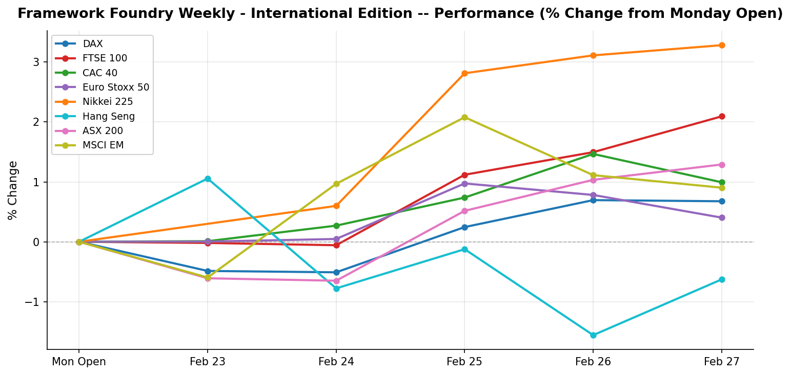

# Framework Foundry Weekly — International Edition

**Week ending 2026-02-28**

---

## The Week in Brief

International markets posted mostly gains this week, with Nikkei 225 (Asia-Pacific) leading at +3.28% and Hang Seng (Asia-Pacific) lagging at -0.63%. European indices outperformed on average (+1.04%); Asia-Pacific led (+1.31% average); Emerging Markets (MSCI EM) moved +0.90%. On the FX front, the Japanese Yen weakened 0.97%, all against the USD.

The macro picture was eventful. Germany Ifo Business Climate (February) came in above expectations (88.6 vs. 88.4).

Looking ahead, key events to watch are: Eurozone CPI Flash (February, YoY), Australia Q4 2025 GDP (QoQ). Central bank decisions in particular can drive sharp FX and equity moves; position sizing should reflect that risk.

---

## Market Snapshot

| Index | Region | Close | Weekly % | Week Range |
|-------|--------|------:|--------:|-----------:|
| Nikkei 225 | Asia-Pacific | 58,850.27 | +3.28% | 56,680.88 - 59,332.43 |
| FTSE 100 | Europe | 10,910.60 | +2.09% | 10,645.80 - 10,934.90 |
| ASX 200 | Asia-Pacific | 9,198.60 | +1.29% | 8,987.20 - 9,202.90 |
| CAC 40 | Europe | 8,580.75 | +0.99% | 8,461.88 - 8,642.23 |
| MSCI EM | Emerging Markets | 62.58 | +0.90% | 61.51 - 65.96 |
| DAX | Europe | 25,284.26 | +0.68% | 24,878.10 - 25,405.97 |
| Euro Stoxx 50 | Europe | 6,138.41 | +0.40% | 6,084.69 - 6,199.78 |
| Hang Seng | Asia-Pacific | 26,630.54 | -0.63% | 26,373.01 - 27,156.28 |

**Best performer:** Nikkei 225 (+3.28%)
| **Worst performer:** Hang Seng (-0.63%)

### FX Rates

| Pair | Rate | Weekly % |
|------|-----:|--------:|
| AUD/USD | 0.7102 | -0.08% |
| CHF/USD | 1.2933 | -0.17% |
| EUR/USD | 1.1803 | -0.23% |
| GBP/USD | 1.3491 | -0.28% |
| JPY/USD | 0.0064 | -0.97% |

---

## Last Week's Economic Events

### Germany Ifo Business Climate (February) (2026-02-23)

| | |
|---|---|
| **Actual** | 88.6 |
| **Expected** | 88.4 |
| **Previous** | 87.6 |
| **Surprise** | above |

**Investor Impact:** German business confidence rose for the second consecutive month, reaching its highest level since August 2025. Manufacturing expectations improved on stronger order flows and upward production planning revisions. However, at 88.6 the index remains well below the long-run average, signaling a recovery that is tentative at best. Euro edged higher on the data; a sustained move above 90 would be needed to confirm a genuine turnaround in Europe's largest economy.

### BOJ Summary of Opinions (January MPM) (2026-02-24)

| | |
|---|---|
| **Actual** | -- |
| **Expected** | -- |
| **Previous** | -- |
| **Surprise** | neutral |

**Investor Impact:** The summary of opinions from the BOJ's January 22-23 meeting (at which the policy rate was held at 0.75%) revealed an increasingly hawkish internal debate. Multiple members indicated readiness to raise rates further if spring Shunto wage negotiations confirm broad-based pay increases above 3%. The yen firmed modestly on publication. EWJ outlook remains mixed: a stronger yen pressures exporters, but a normalizing BOJ signals macro confidence. Next BOJ meeting in late March is now a live event for markets.

### Eurozone CPI Final (January, YoY) (2026-02-25)

| | |
|---|---|
| **Actual** | 1.7% |
| **Expected** | 1.7% |
| **Previous** | 2.0% |
| **Surprise** | inline |

**Investor Impact:** Final Eurozone CPI for January confirmed the flash estimate at 1.7% — the lowest since September 2024 and well below the ECB's 2% target. Core CPI was confirmed at 2.2%, its lowest since October 2021. The print reinforces the ECB's data-dependent hold stance adopted at its February 5 meeting. Modestly positive for Eurozone rate-sensitive assets (EZU, FXE); the low inflation backdrop gives the ECB room to cut later in 2026 if growth disappoints.

---

## Upcoming Week

| Date | Event | Importance |
|------|-------|:----------:|
| 2026-03-02 | China NBS Manufacturing PMI (February) | Medium |
| 2026-03-03 | Eurozone CPI Flash (February, YoY) | High |
| 2026-03-04 | Australia Q4 2025 GDP (QoQ) | High |
| 2026-03-06 | Eurozone Q4 2025 GDP Final (YoY) | Medium |

---

## Positioning Tips

- The Japanese Yen weakened 0.97% against the USD: this reduces USD returns on unhedged Japan exposure (EWJ). Watch BOJ policy signals; any rate hike could trigger a sharp Yen reversal.
- Eurozone CPI Flash on 2026-03-03: a hot print would extend the ECB hold and pressure European bond proxies, while a soft print opens the door for H2 rate cuts, supportive of EFA, FEZ, and EUR-denominated duration.

---

*Disclaimer: This newsletter is for informational purposes only and does not constitute investment advice. Past performance is not indicative of future results. Always do your own research before making investment decisions.*

*Generated by Framework Foundry Weekly — International Edition*