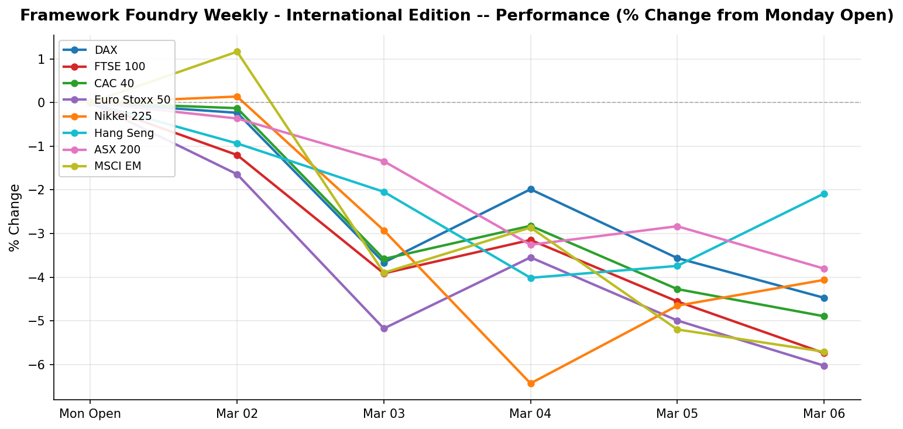

# Framework Foundry Weekly — International Edition

**Week ending 2026-03-07**

---

## The Week in Brief

It was a difficult week across international markets, with Hang Seng (Asia-Pacific) leading at -2.08% and Euro Stoxx 50 (Europe) lagging at -6.03%. European indices underperformed on average (-5.29%); Asia-Pacific lagged (-3.31% average); Emerging Markets (MSCI EM) moved -5.71%. On the FX front, the British Pound weakened 0.37%, the Japanese Yen weakened 0.58%, the Australian Dollar weakened 0.66%, the Euro weakened 1.29%, and the Swiss Franc weakened 1.43%, all against the USD.

The macro picture was eventful. Germany Ifo Business Climate (February) came in above expectations (88.6 vs. 88.4).

Looking ahead, key events to watch are: UK Monthly GDP (January, MoM), ECB Interest Rate Decision. Central bank decisions in particular can drive sharp FX and equity moves; position sizing should reflect that risk.

---

## What This Means

**It was a rough week for international markets.** The best performer was Hang Seng (Asia-Pacific) at -2.1%, while Euro Stoxx 50 (Europe) was the weakest at -6.0%.

European stocks slipped (-5.3% on average). Weakness in Europe's largest economy (Germany) remains a drag.

Asia-Pacific markets declined (-3.3% average) — a soft week for the region.

Emerging markets (MSCI EM) fell -5.7% — a cautious week for EM exposure.

**On currencies:**

- The Japanese Yen weakened 0.6% against the dollar. If you hold Japan ETFs without a currency hedge, some of those stock gains were eaten up by the weaker Yen.

- the Australian Dollar lost 0.7% vs. the dollar (a headwind for unhedged holdings in that currency).

- The Euro slipped 1.3% vs. the dollar — a headwind for unhedged European ETF holders, partially offsetting any stock gains.

- the Swiss Franc lost 1.4% vs. the dollar (a headwind for unhedged holdings in that currency).

**On the economic data front:**

- Germany's Ifo Business Climate index ticked up to 88.6 — a tentative sign that Europe's largest economy may be stabilising. Not a recovery, but the direction is improving.

- The Bank of Japan released meeting minutes that showed growing debate internally about raising rates further. If the BOJ does hike, the Yen typically strengthens — good for dollar-based Japan investors, but exporters (a big chunk of Japan's market) can suffer.

- Eurozone inflation came in as expected at 1.7%. Inflation is on a cooling trend, which gives the ECB room to cut rates later in the year — a quiet positive for European bonds and dividend-paying sectors.

**The bottom line:** A soft week overseas. For investors with international exposure, it's worth checking whether the weakness is concentrated in one region (rotation opportunity) or broad-based (risk-off signal). Don't confuse currency noise with underlying equity weakness — check both.

**Watch next week:** UK Monthly GDP (January, MoM) and ECB Interest Rate Decision. These can move both local markets and currencies sharply — worth being positioned before the releases rather than reacting after.

---

## Market Snapshot

| Index | Region | Close | Weekly % | Week Range |
|-------|--------|------:|--------:|-----------:|
| Hang Seng | Asia-Pacific | 25,757.29 | -2.08% | 24,958.43 - 26,403.85 |
| ASX 200 | Asia-Pacific | 8,851.00 | -3.80% | 8,811.60 - 9,200.90 |
| Nikkei 225 | Asia-Pacific | 55,620.84 | -4.06% | 53,618.20 - 58,365.21 |
| DAX | Europe | 23,591.03 | -4.47% | 23,342.88 - 24,897.61 |
| CAC 40 | Europe | 7,993.49 | -4.90% | 7,913.02 - 8,461.75 |
| MSCI EM | Emerging Markets | 57.32 | -5.71% | 56.56 - 61.85 |
| FTSE 100 | Europe | 10,284.80 | -5.74% | 10,234.50 - 10,911.00 |
| Euro Stoxx 50 | Europe | 5,719.90 | -6.03% | 5,651.35 - 6,086.79 |

**Best performer:** Hang Seng (-2.08%)
| **Worst performer:** Euro Stoxx 50 (-6.03%)

### FX Rates

| Pair | Rate | Weekly % |
|------|-----:|--------:|
| GBP/USD | 1.3357 | -0.37% |
| JPY/USD | 0.0063 | -0.58% |
| AUD/USD | 0.7011 | -0.66% |
| EUR/USD | 1.1608 | -1.29% |
| CHF/USD | 1.2810 | -1.43% |

---

## Last Week's Economic Events

### Germany Ifo Business Climate (February) (2026-02-23)

| | |
|---|---|
| **Actual** | 88.6 |
| **Expected** | 88.4 |
| **Previous** | 87.6 |
| **Surprise** | above |

**Investor Impact:** German business confidence rose for the second consecutive month, reaching its highest level since August 2025. Manufacturing expectations improved on stronger order flows and upward production planning revisions. However, at 88.6 the index remains well below the long-run average, signaling a recovery that is tentative at best. Euro edged higher on the data; a sustained move above 90 would be needed to confirm a genuine turnaround in Europe's largest economy.

### BOJ Summary of Opinions (January MPM) (2026-02-24)

| | |
|---|---|
| **Actual** | -- |
| **Expected** | -- |
| **Previous** | -- |
| **Surprise** | neutral |

**Investor Impact:** The summary of opinions from the BOJ's January 22-23 meeting (at which the policy rate was held at 0.75%) revealed an increasingly hawkish internal debate. Multiple members indicated readiness to raise rates further if spring Shunto wage negotiations confirm broad-based pay increases above 3%. The yen firmed modestly on publication. EWJ outlook remains mixed: a stronger yen pressures exporters, but a normalizing BOJ signals macro confidence. Next BOJ meeting in late March is now a live event for markets.

### Eurozone CPI Final (January, YoY) (2026-02-25)

| | |
|---|---|
| **Actual** | 1.7% |
| **Expected** | 1.7% |
| **Previous** | 2.0% |
| **Surprise** | inline |

**Investor Impact:** Final Eurozone CPI for January confirmed the flash estimate at 1.7% — the lowest since September 2024 and well below the ECB's 2% target. Core CPI was confirmed at 2.2%, its lowest since October 2021. The print reinforces the ECB's data-dependent hold stance adopted at its February 5 meeting. Modestly positive for Eurozone rate-sensitive assets (EZU, FXE); the low inflation backdrop gives the ECB room to cut later in 2026 if growth disappoints.

---

## Upcoming Week

| Date | Event | Importance |
|------|-------|:----------:|
| 2026-03-09 | Japan GDP Final (Q4 2025, QoQ) | Medium |
| 2026-03-10 | UK Monthly GDP (January, MoM) | High |
| 2026-03-11 | China CPI (February, YoY) | Medium |
| 2026-03-12 | Eurozone Industrial Production (January, MoM) | Medium |
| 2026-03-19 | ECB Interest Rate Decision | High |

---

## Positioning Tips

- The Euro weakened 1.29% against the USD: a headwind for unhedged European equity exposure (EFA, FEZ, EWG). Consider currency-hedged alternatives (HEDJ) or reduce European allocation until the Euro stabilises.
- The Japanese Yen weakened 0.58% against the USD: this reduces USD returns on unhedged Japan exposure (EWJ). Watch BOJ policy signals; any rate hike could trigger a sharp Yen reversal.
- The Australian Dollar weakened 0.66% against the USD: a headwind for unhedged Australian equity exposure (EWA). AUD weakness often tracks commodity prices and China growth sentiment.

---

*Disclaimer: This newsletter is for informational purposes only and does not constitute investment advice. Past performance is not indicative of future results. Always do your own research before making investment decisions.*

*Generated by Framework Foundry Weekly — International Edition*