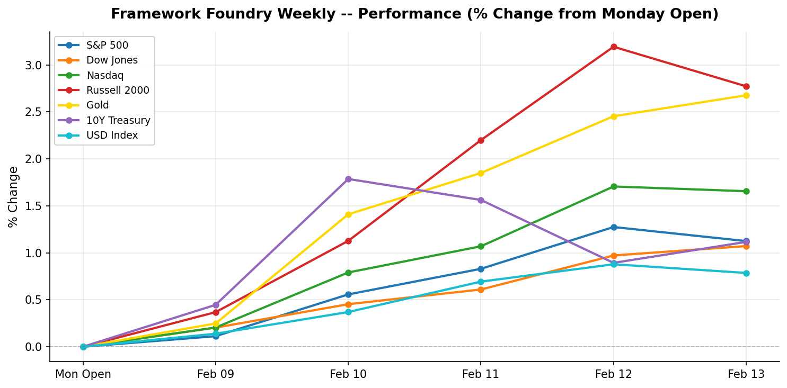

# Framework Foundry Weekly

**Week ending 2026-02-15**

---

## The Week in Brief

Markets rallied across the board this week, with Russell 2000 leading at +2.77% and USD Index lagging at +0.79%. On the safe-haven front, Gold climbing 2.68% to $2,942.10 while the 10-year yield rising to 4.53% while the dollar strengthening 0.79% to 109.05.

The macro picture was busy. CPI (Year-over-Year) came in above expectations (3.1% vs. 2.9%). Initial Jobless Claims came in below expectations (218000 vs. 225000). Retail Sales (Month-over-Month) came in above expectations (0.6% vs. 0.3%). The combination of hot inflation and strong consumer spending paints a picture of an economy that's running warm -- good for earnings, but it keeps rate cuts off the table for now.

Looking ahead, the key events to watch are: FOMC Meeting Minutes, S&P Global Flash US Manufacturing PMI, S&P Global Flash US Services PMI. Position sizing and hedges should reflect the potential for volatility around these releases.

---

## Market Snapshot

| Index | Close | Weekly % | Week Range |
|-------|------:|--------:|-----------:|
| Russell 2000 | 2,343.20 | +2.77% | 2,270.00 - 2,365.00 |
| Gold | 2,942.10 | +2.68% | 2,858.20 - 2,948.20 |
| Nasdaq | 20,005.80 | +1.66% | 19,620.50 - 20,080.50 |
| S&P 500 | 6,106.40 | +1.12% | 6,020.10 - 6,130.50 |
| 10Y Treasury | 4.53 | +1.12% | 4.46 - 4.60 |
| Dow Jones | 44,795.10 | +1.07% | 44,250.00 - 44,800.00 |
| USD Index | 109.05 | +0.79% | 107.90 - 109.40 |

**Best performer:** Russell 2000 (+2.77%)
| **Worst performer:** USD Index (+0.79%)

---

## Last Week's Economic Events

### CPI (Year-over-Year) (2026-02-10)

| | |
|---|---|
| **Actual** | 3.1% |
| **Expected** | 2.9% |
| **Previous** | 2.9% |
| **Surprise** | above |

**Investor Impact:** Hotter-than-expected inflation pressures the Fed to hold rates higher for longer. Bond prices may fall, and rate-sensitive sectors (REITs, utilities) could underperform. Consider inflation hedges like TIPS or commodities.

### Core CPI (Month-over-Month) (2026-02-11)

| | |
|---|---|
| **Actual** | 0.3% |
| **Expected** | 0.3% |
| **Previous** | 0.2% |
| **Surprise** | inline |

**Investor Impact:** In-line core CPI is neutral -- no new signal for the Fed. Markets may look through this and focus on the headline number that came in hot.

### Initial Jobless Claims (2026-02-12)

| | |
|---|---|
| **Actual** | 218000 |
| **Expected** | 225000 |
| **Previous** | 222000 |
| **Surprise** | below |

**Investor Impact:** Fewer layoffs than expected signals continued labor market strength. Good for consumer spending and cyclical stocks, but reinforces the Fed's case to stay hawkish.

### Retail Sales (Month-over-Month) (2026-02-13)

| | |
|---|---|
| **Actual** | 0.6% |
| **Expected** | 0.3% |
| **Previous** | 0.4% |
| **Surprise** | above |

**Investor Impact:** Consumers are spending more than expected -- bullish for retail and discretionary ETFs (XLY, XRT). But strong demand can also feed inflation, keeping rate-cut expectations in check.

---

## Upcoming Week

| Date | Event | Importance |
|------|-------|:----------:|
| 2026-02-16 | Presidents' Day -- Markets Closed | Low |
| 2026-02-18 | FOMC Meeting Minutes | High |
| 2026-02-19 | Housing Starts | Medium |
| 2026-02-20 | S&P Global Flash US Manufacturing PMI | High |
| 2026-02-20 | S&P Global Flash US Services PMI | High |

---

## Positioning Tips

- USD Index strengthened +0.79% this week -- a stronger dollar weighs on multinational earnings and commodities. Consider reducing exposure to export-heavy sectors and commodity ETFs (GLD, DJP).
- CPI came in hot at 3.1% vs. 2.9% expected -- inflation-sensitive sectors may see pressure. Consider TIPS (TIP) or defensive tilts (XLU, XLP).
- Jobless claims came in lower than expected (218,000 vs. 225,000) -- labor market remains tight, supporting risk-on positioning.
- Retail sales surprised to the upside (0.6% vs. 0.3%) -- consumer discretionary (XLY) and cyclicals may benefit.
- FOMC Meeting Minutes on 2026-02-18 -- expect volatility. Consider trimming position sizes or hedging with VIX calls.
- Flash Manufacturing PMI on 2026-02-20 -- a key read on factory activity. Watch industrials (XLI) for directional cues.

---

*Disclaimer: This newsletter is for informational purposes only and does not constitute investment advice. Past performance is not indicative of future results. Always do your own research before making investment decisions.*

*Generated by Framework Foundry Weekly*