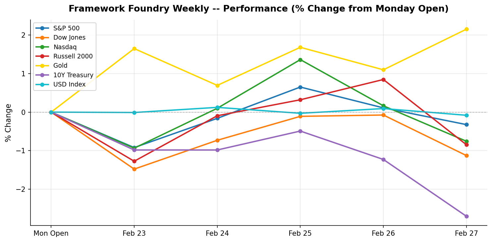

# Framework Foundry Weekly

**Week ending 2026-02-28**

---

## The Week in Brief

Markets were mixed this week, with Gold leading at +2.15% and 10Y Treasury lagging at -2.70%. On the safe-haven front, Gold climbing 2.15% to $5,230.50 while the 10-year yield falling to 3.96% while the dollar weakening 0.08% to 97.57.

The macro picture was busy. Consumer Confidence (CB, February) came in above expectations (91.2 vs. 88.4). PPI (January 2026, MoM) came in above expectations (0.5% vs. 0.3%).

Looking ahead, the key events to watch are: ISM Manufacturing PMI (February), ISM Services PMI (February), Nonfarm Payrolls (February). Position sizing and hedges should reflect the potential for volatility around these releases.

---

## Market Snapshot

| Index | Close | Weekly % | Week Range |
|-------|------:|--------:|-----------:|
| Gold | 5,230.50 | +2.15% | 5,112.70 - 5,280.00 |
| USD Index | 97.57 | -0.08% | 97.28 - 97.94 |
| S&P 500 | 6,878.88 | -0.32% | 6,815.43 - 6,952.51 |
| Nasdaq | 22,668.21 | -0.76% | 22,528.26 - 23,169.68 |
| Russell 2000 | 2,632.36 | -0.85% | 2,600.99 - 2,679.61 |
| Dow Jones | 48,977.92 | -1.13% | 48,678.78 - 49,815.22 |
| 10Y Treasury | 3.96 | -2.70% | 3.96 - 4.07 |

**Best performer:** Gold (+2.15%)
| **Worst performer:** 10Y Treasury (-2.70%)

---

## Last Week's Economic Events

### Consumer Confidence (CB, February) (2026-02-24)

| | |
|---|---|
| **Actual** | 91.2 |
| **Expected** | 88.4 |
| **Previous** | 89.0 |
| **Surprise** | above |

**Investor Impact:** Strong beat on consumer confidence driven by improved labor market optimism. The 2.2-point gain to 91.2 exceeded every analyst forecast, suggesting household spending resilience despite mounting tariff uncertainty. Positive for consumer discretionary (XLY) and financials (XLF). The Expectations sub-index rose sharply to 72.0, though it remains below the 80 threshold historically associated with recession risk.

### PPI (January 2026, MoM) (2026-02-27)

| | |
|---|---|
| **Actual** | 0.5% |
| **Expected** | 0.3% |
| **Previous** | 0.2% |
| **Surprise** | above |

**Investor Impact:** Wholesale inflation ran significantly hotter than expected, with core PPI surging 0.8% vs. 0.3% consensus — the largest monthly core gain in over a year. Broad-based services costs drove the miss. The hot PPI print reignited inflation fears and caused a sharp equity sell-off on Friday. Treasury yields rose across the curve. Watch the delayed PCE report (now rescheduled to March 13) for confirmation of whether producer-level price pressures are feeding through to consumers.

### SCOTUS Tariff Ruling + New Tariff Announcement (2026-02-25)

| | |
|---|---|
| **Actual** | -- |
| **Expected** | -- |
| **Previous** | -- |
| **Surprise** | neutral |

**Investor Impact:** The dominant macro theme of the week: the U.S. Supreme Court ruled 6-3 to block President Trump's broad IEEPA-based global tariff authority. Trump responded by announcing a new blanket 15% global import levy, which came into effect midweek at 10%. Policy uncertainty spiked across all asset classes. Defensives (XLU, XLP) outperformed; import-sensitive cyclicals (XLY, XLI) underperformed. Watch for retaliatory measures from trading partners in coming weeks.

---

## Upcoming Week

| Date | Event | Importance |
|------|-------|:----------:|
| 2026-03-02 | ISM Manufacturing PMI (February) | High |
| 2026-03-04 | ADP Employment Change (February) | Medium |
| 2026-03-04 | ISM Services PMI (February) | High |
| 2026-03-06 | Nonfarm Payrolls (February) | High |
| 2026-03-06 | Unemployment Rate (February) | Medium |

---

## Positioning Tips

- Flash Manufacturing PMI on 2026-03-02 -- a key read on factory activity. Watch industrials (XLI) for directional cues.

---

*Disclaimer: This newsletter is for informational purposes only and does not constitute investment advice. Past performance is not indicative of future results. Always do your own research before making investment decisions.*

*Generated by Framework Foundry Weekly*