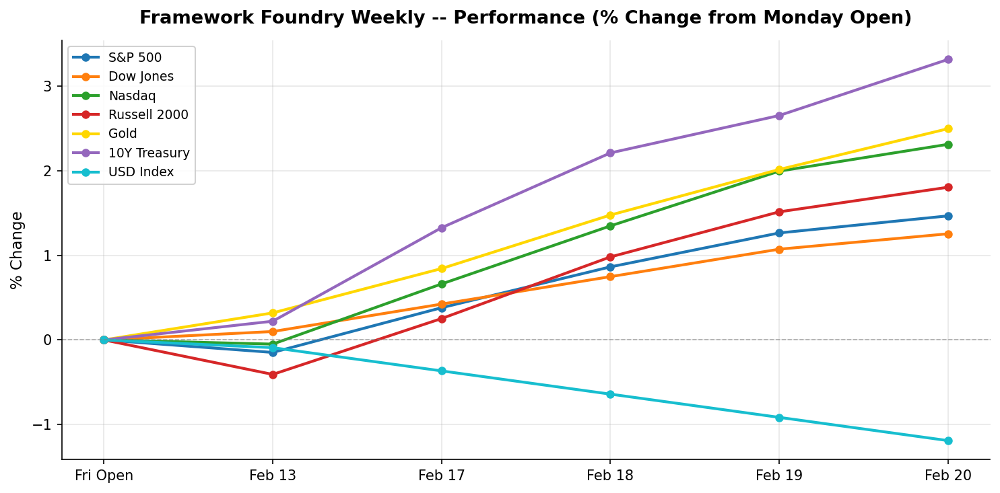

# Framework Foundry Weekly

**Week ending 2026-03-07**

---

## The Week in Brief

Markets were mixed this week, with Nasdaq leading at +0.29% and Russell 2000 lagging at -3.20%. On the safe-haven front, Gold slipping 3.75% to $5,146.10 while the 10-year yield rising to 4.13% while the dollar strengthening 1.19% to 98.98.

The macro picture was busy. Consumer Confidence (CB, February) came in above expectations (91.2 vs. 88.4). PPI (January 2026, MoM) came in above expectations (0.5% vs. 0.3%).

Looking ahead, the key events to watch are: CPI (February, YoY), Core CPI (February, MoM), PPI (February, MoM), PCE Price Index (January, MoM). Position sizing and hedges should reflect the potential for volatility around these releases.

---

## What This Means

**Stocks slipped modestly.** The S&P 500 lost -1.2% — a quiet pullback, not a panic, but the direction was down.

Tech led the way — Nasdaq outperformed the broader market by 1.5 percentage points, meaning growth and tech stocks had a relatively better week.

**Gold fell -3.8%.** Investors feel confident enough that they're not rushing to safety. That's generally a good sign for risk assets.

**Bond yields rose** (the 10-year Treasury climbed to 4.13%). Rising yields mean bonds are losing value — if you hold long-dated bond ETFs (like TLT), that hurt this week. It also makes borrowing more expensive, which weighs on growth stocks.

The dollar strengthened +1.2%. A stronger dollar is a quiet headwind if you hold international stock ETFs — the gains overseas get partially erased when converted back to USD.

**On the economic data front:**

- The Consumer Confidence index came in at 91.2 — higher than expected. Translation: everyday Americans feel relatively okay about their jobs and finances. That tends to support continued spending, which is good for the economy.

- The Producer Price Index — basically what businesses pay for their inputs — came in hotter than expected at 0.5%. This matters because when businesses pay more to make things, they eventually pass those costs on to you as higher prices. It also signals the Fed probably won't be cutting interest rates anytime soon.

- The big non-data story this week was trade policy. A court ruling challenged existing tariffs, and a new 10% blanket import tax was announced. Tariffs raise costs for U.S. companies that import goods — that pressure can squeeze profit margins and eventually show up as higher prices. It's adding an extra layer of uncertainty that the market doesn't love.

**The bottom line:** It was an uncomfortable week to be an investor. Inflation is still sticky, trade policy is unpredictable, and the Fed has no reason to rescue markets with rate cuts yet. That's not a reason to panic — but it is a reason to make sure your portfolio isn't leaning too hard into rate-sensitive or import-dependent sectors.

**Watch next week:** CPI (February, YoY) and Core CPI (February, MoM) are the key releases. These can move markets — particularly bonds and rate-sensitive sectors — so it's worth being positioned before the prints rather than reacting after.

---

## Market Snapshot

| Index | Close | Weekly % | Week Range |
|-------|------:|--------:|-----------:|
| 10Y Treasury | 4.13 | +3.25% | 4.00 - 4.19 |
| USD Index | 98.98 | +1.19% | 97.71 - 99.65 |
| Nasdaq | 22,387.68 | +0.29% | 22,124.78 - 22,891.88 |
| S&P 500 | 6,740.02 | -1.24% | 6,710.42 - 6,901.01 |
| Dow Jones | 47,501.55 | -2.65% | 47,009.01 - 49,064.67 |
| Russell 2000 | 2,525.30 | -3.20% | 2,518.31 - 2,658.62 |
| Gold | 5,146.10 | -3.75% | 5,023.00 - 5,405.00 |

**Best performer:** 10Y Treasury (+3.25%)
| **Worst performer:** Gold (-3.75%)

---

## Last Week's Economic Events

### Consumer Confidence (CB, February) (2026-02-24)

| | |
|---|---|
| **Actual** | 91.2 |
| **Expected** | 88.4 |
| **Previous** | 89.0 |
| **Surprise** | above |

**Investor Impact:** Strong beat on consumer confidence driven by improved labor market optimism. The 2.2-point gain to 91.2 exceeded every analyst forecast, suggesting household spending resilience despite mounting tariff uncertainty. Positive for consumer discretionary (XLY) and financials (XLF). The Expectations sub-index rose sharply to 72.0, though it remains below the 80 threshold historically associated with recession risk.

### PPI (January 2026, MoM) (2026-02-27)

| | |
|---|---|
| **Actual** | 0.5% |
| **Expected** | 0.3% |
| **Previous** | 0.2% |
| **Surprise** | above |

**Investor Impact:** Wholesale inflation ran significantly hotter than expected, with core PPI surging 0.8% vs. 0.3% consensus — the largest monthly core gain in over a year. Broad-based services costs drove the miss. The hot PPI print reignited inflation fears and caused a sharp equity sell-off on Friday. Treasury yields rose across the curve. Watch the delayed PCE report (now rescheduled to March 13) for confirmation of whether producer-level price pressures are feeding through to consumers.

### SCOTUS Tariff Ruling + New Tariff Announcement (2026-02-25)

| | |
|---|---|
| **Actual** | -- |
| **Expected** | -- |
| **Previous** | -- |
| **Surprise** | neutral |

**Investor Impact:** The dominant macro theme of the week: the U.S. Supreme Court ruled 6-3 to block President Trump's broad IEEPA-based global tariff authority. Trump responded by announcing a new blanket 15% global import levy, which came into effect midweek at 10%. Policy uncertainty spiked across all asset classes. Defensives (XLU, XLP) outperformed; import-sensitive cyclicals (XLY, XLI) underperformed. Watch for retaliatory measures from trading partners in coming weeks.

---

## Upcoming Week

| Date | Event | Importance |
|------|-------|:----------:|
| 2026-03-10 | JOLTS Job Openings (January) | Medium |
| 2026-03-11 | CPI (February, YoY) | High |
| 2026-03-11 | Core CPI (February, MoM) | High |
| 2026-03-12 | PPI (February, MoM) | High |
| 2026-03-13 | PCE Price Index (January, MoM) | High |
| 2026-03-13 | Michigan Consumer Sentiment (March, Preliminary) | Medium |

---

## Positioning Tips

- USD Index strengthened +1.19% this week -- a stronger dollar weighs on multinational earnings and commodities. Consider reducing exposure to export-heavy sectors and commodity ETFs (GLD, DJP).
- PCE Price Index on 2026-03-13 -- the Fed's preferred inflation gauge. A hot print could reprice rate-cut expectations; consider hedging bond duration (TLT) and adding inflation protection (TIPS, GLD).

---

*Disclaimer: This newsletter is for informational purposes only and does not constitute investment advice. Past performance is not indicative of future results. Always do your own research before making investment decisions.*

*Generated by Framework Foundry Weekly*