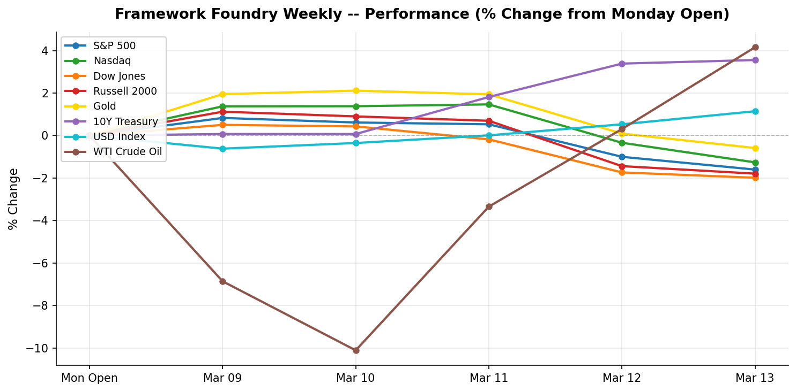

# Framework Foundry Weekly

**Week ending 2026-03-14**

---

## The Week in Brief

It was a down week across the board for equities: S&P 500 closing at 6,632.19 (-1.60%), Nasdaq closing at 22,105.36 (-1.26%), Dow Jones closing at 46,558.47 (-1.99%), Russell 2000 closing at 2,480.05 (-1.79%). The decline was broad-based — all major indices moved lower together, a sign of broad risk-off sentiment rather than isolated sector weakness.

The 10-year Treasury yield climbed 15 bps to 4.28% — rising yields signal the bond market is pricing out rate cuts, which puts pressure on rate-sensitive growth stocks and long-duration bonds. Gold moved -0.59% to $5,061.70, a modest pullback with no strong directional signal. The dollar strengthened +1.15% (DXY: 100.43), a headwind for multinational earnings and international ETF holders. WTI crude rose +4.16% to $98.71/bbl — a meaningful move that adds upward pressure on energy costs and inflation expectations.

Fed repricing was the dominant narrative: rising yields reflected a bond market pushing back on near-term rate-cut hopes, weighing on rate-sensitive sectors. Trade policy added a layer of uncertainty — Volkswagen flags a tough year ahead as 2025 profit halves on tariffs, China competition. Geopolitical risk was a direct market driver — Middle East conflict headlines pushed WTI crude +4.16% higher on the week to $98.71/bbl, raising fears of supply disruption through the Strait of Hormuz and adding an inflationary wildcard to an already hawkish rate environment.

On the economic data front, JOLTS Job Openings (January 2026) beat expectations (6.946M vs. 6.8M forecast); CPI (February 2026, MoM / YoY) missed expectations (0.3% / 2.4% vs. 0.3% / 2.6% forecast); Core CPI (February 2026, MoM / YoY) missed expectations (0.2% / 2.5% vs. 0.3% / 3.1% forecast); PCE Price Index (January 2026) beat expectations (0.3% MoM / Core +0.4% MoM / Core +3.1% YoY vs. 0.3% / Core 0.3% forecast); Michigan Consumer Sentiment (March 2026, Preliminary) missed expectations (55.5 vs. 63.0 forecast). Hotter-than-expected inflation data reduces the probability of near-term rate cuts, keeping pressure on rate-sensitive assets.

Next week's calendar is heavy. The FOMC rate decision is the marquee event — markets will parse the statement and press conference for any shift in the rate-cut timeline. The dot plot update will reset expectations for the rest of 2026; PPI will offer an early read on pipeline inflation pressures. Volatility around these releases is likely — position before the prints, not after. Secondary data to watch: Housing Starts & Building Permits (February 2026), Initial Jobless Claims (week of Mar 15).

---

## What This Means

**This week's selloff was broad and deep.** The S&P 500 dropped 1.6%, but the story is in the width: small caps (Russell 2000 -1.79%), tech (Nasdaq -1.26%), blue chips (Dow -1.99%) all fell together — this wasn't sector rotation, it was risk-off across the board. A $10,000 index portfolio lost roughly $160. The dollar also strengthened +1.1% — a quiet headwind if you hold international ETFs, as foreign gains get partially erased when converted back to USD.

**The bond market is repricing the Fed.** The 10-year yield climbed 15 bps over the week to 4.28%, signalling that rate-cut expectations are fading. Higher yields at current levels compress equity valuations, particularly growth and small caps — which is why the Nasdaq (-1.26%) and Russell (-1.79%) lagged the broader index.

**Trade risk added fuel this week.** Volkswagen flags a tough year ahead as 2025 profit halves on tariffs, China competition. Combined with ongoing Iran-Israel war tensions, investors are pricing in more geopolitical premium. WTI crude reflected the tension directly, surging +4.16% to $98.71/bbl on supply disruption fears. Worth noting: gold fell 0.59% despite the equity selloff — a sign the dollar's tariff-driven strength is the dominant force, not a simple flight to safety.

Headline CPI came in cooler than expected at 0.3% / 2.4%. Progress on inflation gives the Fed more room to cut rates, which tends to be a positive for both stocks and bonds. Core CPI — the Fed's cleanest read on underlying inflation — came in softer than expected at 0.2% / 2.5%. This is the most encouraging kind of disinflation: not just cheaper gas, but genuine easing of underlying price pressures. It gives the Fed more room to eventually cut rates. The PCE inflation reading — the Fed's preferred measure — came in hotter than expected at 0.3% MoM / Core +0.4% MoM / Core +3.1% YoY. This tells the Fed that inflation isn't beaten yet, making interest rate cuts less likely and keeping pressure on stocks.

**Key events next week: Retail Sales (February 2026) and FOMC Rate Decision.** These can move markets — particularly bonds and rate-sensitive sectors. Be positioned before the releases, not after.

---

## Market Snapshot

| Index | Close | Weekly % | Week Range |
|-------|------:|--------:|-----------:|
| WTI Crude Oil | 98.71 | +4.16% | 85.19 - 98.71 |
| 10Y Treasury | 4.28 | +3.56% | 4.13 - 4.28 |
| USD Index | 100.43 | +1.15% | 98.68 - 100.43 |
| Gold | 5,061.70 | -0.59% | 5,061.70 - 5,199.20 |
| Nasdaq | 22,105.36 | -1.26% | 22,105.36 - 22,716.13 |
| S&P 500 | 6,632.19 | -1.60% | 6,632.19 - 6,795.99 |
| Russell 2000 | 2,480.05 | -1.79% | 2,480.05 - 2,553.67 |
| Dow Jones | 46,558.47 | -1.99% | 46,558.47 - 47,740.80 |

**Best performer:** WTI Crude Oil (+4.16%)
| **Worst performer:** Dow Jones (-1.99%)

---

## Last Week's Economic Events

### JOLTS Job Openings (January 2026) (2026-03-11)

| | |
|---|---|
| **Actual** | 6.946M |
| **Expected** | 6.8M |
| **Previous** | 6.55M |
| **Surprise** | above |

**Investor Impact:** Job openings rose to 6.946M (approximately 7M) in January, beating the prior month's revised 6.55M and exceeding consensus. While openings remain well below the post-pandemic peak (~12M), the rebound from December's soft print suggests the labor market is holding up better than feared. A resilient job market reduces the Fed's urgency to cut rates.

### CPI (February 2026, MoM / YoY) (2026-03-11)

| | |
|---|---|
| **Actual** | 0.3% / 2.4% |
| **Expected** | 0.3% / 2.6% |
| **Previous** | 0.3% / 2.6% |
| **Surprise** | below |

**Investor Impact:** Headline CPI held at +0.3% MoM but the YoY rate cooled to 2.4% from 2.6%, coming in below consensus. 'Inflation held steady' was the headline read — markets took this as a mildly positive surprise, with YoY disinflation continuing. However, the Fed will want to see this confirmed in Core PCE before adjusting its stance.

### Core CPI (February 2026, MoM / YoY) (2026-03-11)

| | |
|---|---|
| **Actual** | 0.2% / 2.5% |
| **Expected** | 0.3% / 3.1% |
| **Previous** | 0.3% / 3.0% |
| **Surprise** | below |

**Investor Impact:** Core CPI (ex-food and energy) came in soft at +0.22% MoM — below the +0.3% consensus and the softest monthly reading in several months. The YoY rate eased to 2.47%, a mild disinflationary signal. This was the most encouraging data point of the week, suggesting underlying price pressures may be easing. Growth and rate-sensitive assets responded positively.

### PCE Price Index (January 2026) (2026-03-13)

| | |
|---|---|
| **Actual** | 0.3% MoM / Core +0.4% MoM / Core +3.1% YoY |
| **Expected** | 0.3% / Core 0.3% |
| **Previous** | 0.3% / Core 0.4% |
| **Surprise** | above |

**Investor Impact:** The Fed's preferred inflation gauge showed Core PCE at +3.05% YoY — well above the 2% target and the headline read was 'key inflation gauge worsened.' Core PCE MoM (+0.36%, rounds to 0.4%) came in above consensus. This offset the softer CPI print from Tuesday, reinforcing the higher-for-longer rate narrative heading into the FOMC meeting next week. Rate-sensitive assets sold off on the release.

### Michigan Consumer Sentiment (March 2026, Preliminary) (2026-03-13)

| | |
|---|---|
| **Actual** | 55.5 |
| **Expected** | 63.0 |
| **Previous** | 64.7 |
| **Surprise** | below |

**Investor Impact:** Consumer sentiment dropped sharply to 55.5 in the March preliminary reading, well below the February final of 64.7 and consensus expectations. The 9.2-point drop signals a sudden deterioration in household confidence — likely reflecting oil price spikes, tariff uncertainty, and geopolitical anxiety. Weak sentiment is a leading indicator of softer consumer spending. Watch whether the final March reading confirms this drop.

---

## Upcoming Week

| Date | Event | Importance |
|------|-------|:----------:|
| 2026-03-16 | Retail Sales (February 2026) | High |
| 2026-03-17 | Housing Starts & Building Permits (February 2026) | Medium |
| 2026-03-18 | FOMC Rate Decision | High |
| 2026-03-18 | PPI (February 2026) | High |
| 2026-03-18 | FOMC Summary of Economic Projections (Dot Plot) | High |
| 2026-03-19 | Initial Jobless Claims (week of Mar 15) | Medium |
| 2026-03-19 | Philadelphia Fed Manufacturing Survey (March) | Medium |

---

## Positioning Tips

- USD Index strengthened +1.15% this week -- a stronger dollar weighs on multinational earnings and commodities. Consider reducing exposure to export-heavy sectors and commodity ETFs (GLD, DJP).
- FOMC Rate Decision on 2026-03-18 -- expect volatility around the announcement and press conference. Consider trimming position sizes or hedging with VIX calls.

---

*Disclaimer: This newsletter is for informational purposes only and does not constitute investment advice. Past performance is not indicative of future results. Always do your own research before making investment decisions.*

*Generated by Framework Foundry Weekly*